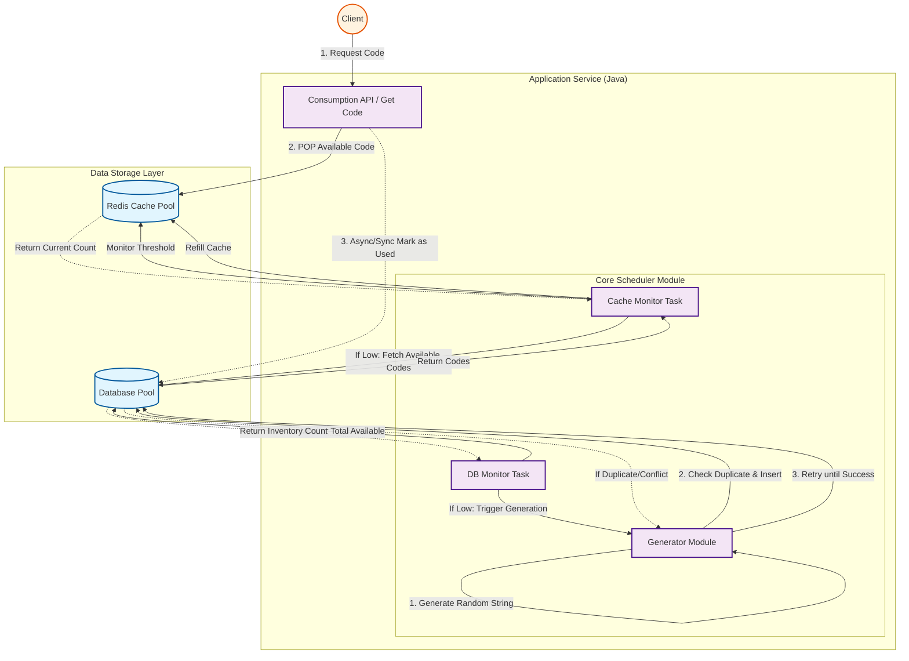

# Random String Code Generation Service

This is a high-performance Java service designed to generate, manage, and distribute unique fixed-length random string codes (e.g., vouchers, coupons, invite codes).

The system ensures uniqueness, high availability, and low latency by utilizing a multi-layer architecture with a database code pool for persistence and a Redis cache pool for fast consumption.

## 🏗 System Architecture

The system is divided into three main layers: **Interface Layer**, **Business & Scheduling Layer**, and **Data Storage Layer**.



### Core Workflows

1.  **Consumption (Interface Layer)**
    *   **Goal**: Provide codes to external systems with minimal latency.
    *   **Mechanism**: The API fetches codes directly from **Redis**.
    *   **Post-Process**: Once consumed, the status of the code is updated to "USED" in the main **Database** (asynchronously or synchronously depending on consistency requirements).

2.  **Cache Replenishment (Monitor Task)**
    *   **Goal**: Ensure Redis always has codes ready for consumption.
    *   **Logic**: A background task monitors the Redis pool size. If it drops below a configured threshold, it fetches a batch of "AVAILABLE" codes from the Database and pushes them to Redis.

3.  **Code Generation (Generator & DB Monitor)**
    *   **Goal**: Maintain a healthy inventory of unique codes in the persistent storage.
    *   **Logic**: A background task monitors the total count of "AVAILABLE" codes in the Database.
    *   **Generation Rule**: If inventory is low, the Generator creates random strings. It ensures uniqueness by leveraging database unique constraints (handling collisions by regenerating).

---

## 🛠 Tech Stack

*   **Language**: Java (JDK 17+)
*   **Framework**: Spring Boot (Web, Data JPA/MyBatis)
*   **Database**: MySQL / PostgreSQL (Persisting code lifecycle)
*   **Cache**: Redis (High-speed consumption queue)
*   **Scheduling**: Spring Task / Quartz / XXL-JOB

## 🚀 Getting Started

### Prerequisites

*   Java 17+
*   Maven / Gradle
*   MySQL running on port 3306
*   Redis running on port 6379

### Configuration

Update `application.yml` with your database and thresholds:

```yaml
spring:
  datasource:
    url: jdbc:mysql://localhost:3306/code_db
    username: root
    password: password
  data:
    redis:
      host: localhost
      port: 6379

code-service:
  pool:
    # Trigger generation when DB pool is below this
    db-min-threshold: 50000 
    # Target size for DB pool
    db-target-size: 100000
    # Trigger refill when Redis cache is below this
    cache-min-threshold: 1000
    # Batch size to refill Redis
    cache-refill-batch: 500
```

### Running the Application

1.  **Build the project**:
    ```bash
    mvn clean package
    ```
2.  **Run the JAR**:
    ```bash
    java -jar target/code-generation-service.jar
    ```

## 📊 Database Schema

```sql
CREATE TABLE coupon_codes (
    id BIGINT AUTO_INCREMENT PRIMARY KEY,
    code VARCHAR(16) NOT NULL UNIQUE,
    status TINYINT DEFAULT 0 COMMENT '0: Available, 1: Used',
    created_at TIMESTAMP DEFAULT CURRENT_TIMESTAMP,
    updated_at TIMESTAMP DEFAULT CURRENT_TIMESTAMP ON UPDATE CURRENT_TIMESTAMP,
    INDEX idx_status (status)
);
```

## 🤝 Contributing

1.  Fork the repository
2.  Create your feature branch (`git checkout -b feature/AmazingFeature`)
3.  Commit your changes (`git commit -m 'Add some AmazingFeature'`)
4.  Push to the branch (`git push origin feature/AmazingFeature`)
5.  Open a Pull Request

## 📄 License

Distributed under the MIT License. See `LICENSE` for more information.
